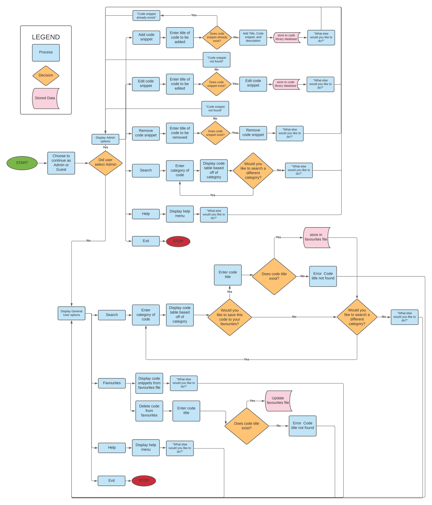
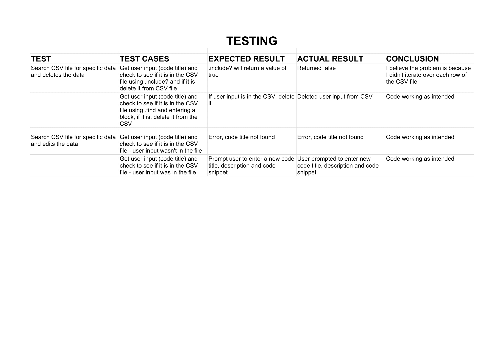

# Link to GitHub Repository

https://github.com/DanielJamesK/CodeLibrary/tree/master

# Purpose and Scope

The application I am developing is a code library. It will supply the user with on demand code snippets to the search enquiry they input. At first it will only have a library of CSS code, but future development will include code snippets from other technologies. The application works by the user looking up categories of code, for example Images. If they are a Guest user, they can then add any of the code they find useful to their favourites file. If the Guest user decides they don't need the code they saved anymore, they can choose to delete it.

The application is populated by the Admin user. The Admin user has full CRUD (Create, Read, Update, Delete) capabilities, as well as also being able to search for code snippets.

# The Problem

The problem the application is solving is that as a junior developer, participating in a fast track course, it can be difficult to remember everything taught about previous technologies. This application aims to remedy this by providing a resource that students can search, in order to familiarize themslves once again with previously taught content.

# Target Audience

The target audience for the application is junior developers, however, I believe developers of all skill levels could benefit from the code library.

# User Interaction and Experience

If the user is unsure how to use the code library, they can use the Help option from the Main Menu to help them navigate the application.

- The user will choose to enter the app as an Admin or a Guest
- If the user is an Admin, the options displayed after logging in will be:

  - Add code snippet
  - Edit code snippet
  - Remove code snippet
  - Search
  - Help
  - Exit

- If the user is a General user, the options displayed after logging in will be:
  - Search
    - Add to favourites
    - Print to screen
  - Favourites
    - Print to screen
    - Delete code from favourites
  - Help
  - Exit

# Features

## Feature 1

- Have 2 types of users, the Admin user that can add, remove or edit code. The admin can also search for code. And a Guest user, that can search for code, and save the code they find most useful to their favourites.

## Feature 2

- Display code snippets that are relevant to the users search requests

## Feature 3

- Store the information the Guest user adds into a favourites file. The guest can delete code from their favourites if they don't need the code anymore.

# Error Handling

Any errors the user might experience will be displayed using error handling. For example if the Admin tries to Remove code that isn't in the library, they will be displayed with the error - Error: Code Title not found.

# Control Flow

# Implementation Plan

## Link to Trello Board

https://trello.com/b/qiwUFT2d

# Testing

